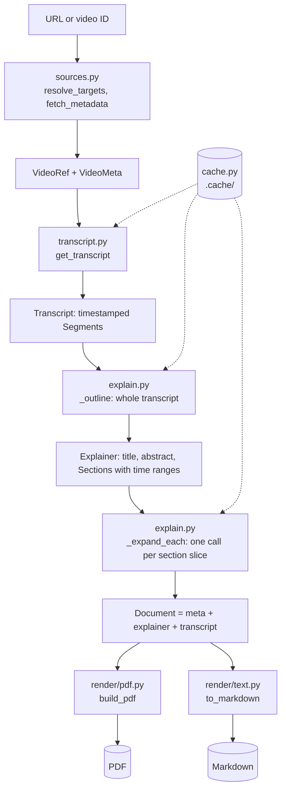

# Architecture

How ytexplain is built, why it is built this way, and where to change it.
Read this before adding a feature; the `README.md` covers installation and day-to-day
usage instead.

## What the project is

A command line tool that takes a YouTube video or playlist and produces a PDF that
teaches the same material in written form. The target reader is someone facing a
twenty-video, twenty-hour playlist who would rather read it in an afternoon.

The distinction that drives every design decision below: this is **not a summariser**.
A summary tells you what topics were covered. This is meant to replace watching, so it
has to explain mechanisms, define terms, keep every command and code sample, and preserve
the pitfalls the speaker mentions.

## The core idea

Generation runs in **two passes**, and this is the single most important thing to
understand before changing the generation code.

1. **Plan** — the entire transcript goes to the model, which returns a structured outline:
   document title, abstract, prerequisites, a list of sections each with the *time range*
   it covers, glossary terms, takeaways.
2. **Expand** — each section gets its own model call, receiving only that section's slice
   of the transcript plus the outline for context. Sections are written in parallel.

Why not one call? A single call has to fit an entire document into one response, so it
compresses: you get bullet points and topic sentences. Per-section calls each have a full
output budget for a few minutes of video, which is what buys real explanation. The outline
is what keeps independent calls from overlapping, repeating each other, or leaving gaps.

The cost is more calls, so `--fast` keeps a one-shot path (plan, then write everything in
a single JSON response) for when cheap matters more than depth.

## Data flow



Everything between stages travels as plain dataclasses defined in `models.py`:

| Type | Meaning |
| --- | --- |
| `VideoRef` | a video we intend to process, before any network call |
| `VideoMeta` | title, channel, duration, playlist position |
| `Segment` / `Transcript` | timestamped caption cues plus language and provenance |
| `Section` | heading, focus, time range, and eventually the written body |
| `Explainer` | the whole planned and written document |
| `Document` | `VideoMeta + Explainer + Transcript`; one chapter of a PDF |

A single-video PDF is just `build_pdf([document])`. A combined playlist PDF is
`build_pdf([doc1, doc2, ...])`. There is no separate code path for playlists in the
renderer, which is why `--combined` was nearly free to add.

## Module map

| File | Responsibility | Notes for changes |
| --- | --- | --- |
| `cli.py` | argument parsing, per-URL loop, progress output, error reporting | the only module that prints |
| `pipeline.py` | stage orchestration for one video, output path naming | add cross-stage options to `Options` here |
| `sources.py` | URL parsing, playlist enumeration, metadata | pure functions, easy to unit test |
| `transcript.py` | caption retrieval with fallback and track selection | two independent backends |
| `explain.py` | the two-pass generation, transcript slicing, JSON coercion | the quality-critical module |
| `prompts.py` | all prompt text, nothing else | change wording here, never inline in `explain.py` |
| `llm.py` | OpenRouter HTTP, retries, JSON repair, usage accounting | provider-specific code is confined here |
| `cache.py` | content-addressed disk cache | namespaces: `transcripts`, `completions` |
| `models.py` | the dataclasses above | shared vocabulary, no logic beyond text helpers |
| `render/markdown.py` | Markdown subset to ReportLab flowables | reused for every section and list |
| `render/pdf.py` | styles, page template, document assembly | all visual design lives here |
| `render/text.py` | Explainer back to Markdown | for `--markdown` |
| `config.py` | settings from flags, then env, then defaults | |

## Stage detail and the reasoning behind it

### Input resolution (`sources.py`)

`extract_video_id` handles `watch?v=`, `youtu.be`, `/shorts/`, `/embed/`, `/live/` and bare
11-character IDs. `extract_playlist_id` deliberately rejects `RD`, `UL`, `WL` and `LL`
prefixes — those are mixes and personal lists that cannot be enumerated anonymously.

A `watch?v=...&list=...` URL resolves to the **single video** unless `--playlist` is passed.
Users usually paste that URL meaning "this video", and processing twenty videos by accident
costs real money.

Metadata comes from YouTube's oEmbed endpoint, not yt-dlp: it is one fast HTTP call, needs
no API key, and duration can be recovered from the transcript instead. yt-dlp is reserved
for playlist enumeration and the caption fallback, where nothing else works.

### Transcript acquisition (`transcript.py`)

Track preference, in `_choose_track`: manually written captions in a preferred language,
then auto-generated in a preferred language, then any manual track, then anything at all.
Human captions are meaningfully more accurate on technical terms.

Two backends run in order, and `get_transcript` only fails if both do:

1. `youtube-transcript-api` — fast and direct.
2. `yt-dlp` — negotiates a full player response and reads caption URLs from it. This is the
   escape hatch for rate limits, datacenter IPs and consent walls.

Adding a third source means writing a `_via_x(video_id, languages) -> Transcript` function
and appending it to the loop in `get_transcript`; nothing else changes.

### Language handling (`explain.py::_rules`, `prompts.py`)

Three rules compose depending on what the transcript actually is:

- `BASE_RULE` — always applied. Captions are unscripted speech with unreliable sentence
  boundaries; output must be idiomatic written English.
- `TRANSLATION_RULE` — when the track is not English. Translate meaning, not words, and
  keep standard English technical terms.
- `CAPTION_RULE` — when the track is auto-generated. Expect misheard words and mangled
  code, repair from context, never quote an obvious mis-transcription.

`BASE_RULE` exists because of a real case worth remembering: many Hindi tech channels ship
an `en-IN` track that is a literal machine translation of Hindi speech ("In start you will
feel that, it is so easy"). It is tagged English, so no language check catches it. Always
instructing idiomatic rewriting covers it without needing detection.

### The outline pass

`OUTLINE_SYSTEM` demands a fixed JSON shape and, importantly, `start`/`end` timestamps per
section. Those timestamps are what make the expansion pass cheap and focused. The prompt
also tells the model to group by concept rather than by minute, to skip sponsor reads and
outros, and to write headings that name the subject rather than "Part 3".

Transcripts longer than `OUTLINE_CHAR_LIMIT` (600k characters, far beyond a three-hour
video) are head-and-tail truncated rather than chunked. Raise the limit or add real
chunking if that ever bites.

### The expansion pass

`_slice_for` takes the section's time range with `SLICE_PADDING` seconds either side, and
falls back to the full transcript when a slice comes back implausibly short — a guard
against the model returning nonsense time ranges.

Each call also receives `_outline_listing` with its own section marked `>>>`, so the model
knows what the neighbouring sections will cover and does not duplicate them.

Concurrency is a `ThreadPoolExecutor` over `as_completed`, default 4. The HTTP client is
thread-safe and usage counters are lock-guarded.

`--fast` calls `_expand_together` instead, which returns `False` if the response is
unusable; `build_explainer` then falls back to per-section writing rather than emitting an
empty document.

### Rendering (`render/`)

`MarkdownRenderer.render` is a line-based parser over the Markdown subset the model emits:
headings, paragraphs, nested lists, fenced code, blockquotes, pipe tables, rules, and
inline bold/italic/strike/code/links. It converts to ReportLab flowables using a style
dictionary supplied by `build_styles`, so appearance and parsing stay separate.

`render(body, min_heading=3)` floors heading levels for section bodies. Without it, a `##`
the model wrote inside a section competes with real section headings in the table of
contents.

`NotesDocTemplate.afterFlowable` is what produces both the table of contents and the PDF
bookmark tree: it fires for every `Paragraph` whose style name is in `TOC_LEVELS`
(`H1` → 0, `H2` → 1, `H3` → 2). To add something to the contents, give its paragraph one of
those style names; to keep something out, use a style name outside the map (`h1_plain`
exists exactly for the "Contents" title itself).

### Caching (`cache.py`)

Keys are SHA-256 over the inputs that determine the output: video ID and language list for
transcripts, and model, system prompt, user prompt, temperature and token limit for
completions. Because prompts are part of the key, editing a prompt naturally invalidates
only what it affects.

Truncated responses are deliberately not cached, so a token-limit failure is not made
permanent.

Nothing about rendering enters the key, which is the point: change styles, page layout or
the Markdown parser and every previously processed video re-renders for free. Only changes
to what the model is *asked* — model slug, prompt text, temperature, token limit — cause new
calls. Entries are plain JSON under `.cache/<namespace>/<hash>.json`, so you can read one to
see exactly what the model returned, and delete a namespace to rebuild just that stage.

There is no expiry or size limit. If a video's captions are corrected upstream, the stale
transcript stays until `.cache/transcripts` is cleared.

## How do I…

**Add a CLI flag** — add it in `cli.py::parse_args`; if any stage below the CLI needs it,
put it on `pipeline.Options` rather than threading an extra parameter through.

**Change the writing style or depth** — edit `SECTION_SYSTEM` in `prompts.py`. Keep the
instruction not to repeat the heading and to use `###` for subheadings; the renderer and
the table of contents assume both.

**Change the document structure** (new section type, different front matter) — extend the
JSON shape in `OUTLINE_SYSTEM`, add the field to `Explainer` in `models.py`, parse it in
`_explainer_from_outline`, and render it in `render/pdf.py::_chapter`.

**Change how the PDF looks** — everything is in `build_styles` and the helpers in
`render/pdf.py` (`_cover`, `_callout`, `_glossary`, `_appendix`). Verify with
`uv run python scripts/render_sample.py`, which exercises every element without an API call.

**Add an output format** (HTML, EPUB, Anki) — write a module beside `render/text.py` that
consumes a `Document`. Nothing upstream needs to know.

**Use a different model or provider** — any OpenRouter slug works via `--model`. For a
different provider entirely, reimplement `OpenRouterClient.complete` and `complete_json`;
they are the only interface `explain.py` uses.

**Process a source other than YouTube** — produce a `VideoMeta` and a `Transcript`, then
call `build_explainer`. The generation and rendering stages have no YouTube knowledge.

## Constraints and gotchas

These were all found the hard way; changing the related code without knowing them will
reintroduce the bug.

- **ReportLab `multiBuild` runs the layout repeatedly.** Bookmark keys must be identical on
  every pass or the table of contents never converges and the build raises
  "Index entries not resolved". `NotesDocTemplate.beforeDocument` resets the counter for
  this reason.
- **Models emit literal newlines inside JSON strings.** `json.loads` rejects them in strict
  mode. `llm._loads` retries with `strict=False`; do not remove it.
- **Recovering JSON from a broken response can latch onto a nested object.** `complete_json`
  takes `require_key` and validates the shape, which is why a truncated `--fast` response
  now fails loudly and falls back instead of silently producing zero sections.
- **ReportLab does no complex text shaping.** Devanagari in the optional transcript appendix
  is legible but not correctly conjoined. The explainer body is English so this only affects
  `--include-transcript`. A proper fix needs HarfBuzz shaping, not a different font.
- **Standard PDF fonts are Latin-only.** `_register_unicode_font` looks for Arial Unicode or
  DejaVu and degrades gracefully when neither exists.
- **Escape before applying inline markup**, never after, or user text containing `<` becomes
  broken ReportLab markup. Code spans are stashed as placeholders first so their contents are
  never reinterpreted.

## Testing

`uv run pytest` covers URL parsing, the Markdown renderer, language rule selection,
timestamp coercion and JSON leniency. It needs no network and no API key, so it is safe to
run in a loop while editing.

`uv run python scripts/render_sample.py` renders a synthetic document exercising every
Markdown feature, both single and multi-chapter. Use it for any layout change.

For inspecting output visually, rasterise a page:

```bash
uv run --with pypdfium2 python -c "
import pypdfium2 as p
pdf = p.PdfDocument('out/sample.pdf')
pdf[2].render(scale=2).to_pil().save('out/page3.png')"
```

The cache makes end-to-end reruns free after the first, so re-running a real video to check
a rendering change costs nothing.

## Cost and performance

Measured with `claude-sonnet-5` on a 10-minute tutorial: roughly 70 seconds and $0.15 for
per-section mode (one outline call plus one per section), or 2 calls and about $0.08 with
`--fast`. Cost scales with section count rather than video length, since each expansion call
sees only its own slice. Wall time is dominated by the slowest section, not their sum,
because of the thread pool.
