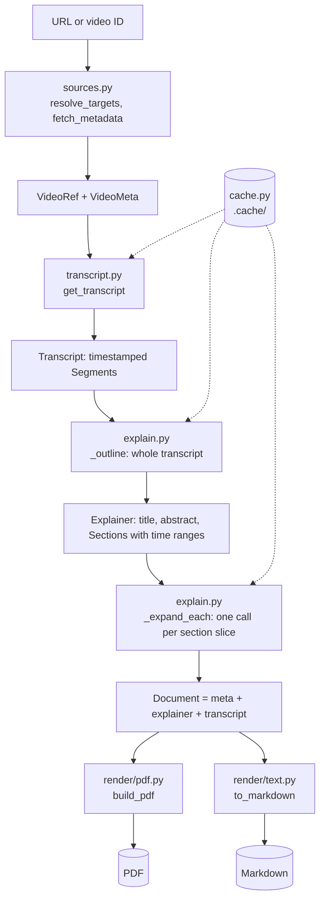
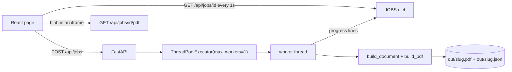

# Architecture

How ytexplain is built, why it is built this way, and where to change it.
Read this before adding a feature; the `README.md` covers installation and day-to-day
usage instead.

## What the project is

A command line tool that takes a YouTube video or playlist and produces a PDF that
teaches the same material in written form. The target reader is someone facing a
twenty-video, twenty-hour playlist who would rather read it in an afternoon.

The distinction that drives every design decision below: this is **not a summariser**.
A summary tells you what topics were covered. This is meant to replace watching, so it
has to explain mechanisms, define terms, keep every command and code sample, and preserve
the pitfalls the speaker mentions.

## The core idea

Generation runs in **two passes**, and this is the single most important thing to
understand before changing the generation code.

1. **Plan** — the entire transcript goes to the model, which returns a structured outline:
   document title, abstract, prerequisites, a list of sections each with the *time range*
   it covers, glossary terms, takeaways.
2. **Expand** — each section gets its own model call, receiving only that section's slice
   of the transcript plus the outline for context. Sections are written in parallel.

Why not one call? A single call has to fit an entire document into one response, so it
compresses: you get bullet points and topic sentences. Per-section calls each have a full
output budget for a few minutes of video, which is what buys real explanation. The outline
is what keeps independent calls from overlapping, repeating each other, or leaving gaps.

The cost is more calls, so `--fast` keeps a one-shot path (plan, then write everything in
a single JSON response) for when cheap matters more than depth.

## Data flow



Everything between stages travels as plain dataclasses defined in `models.py`:

| Type | Meaning |
| --- | --- |
| `VideoRef` | a video we intend to process, before any network call |
| `VideoMeta` | title, channel, duration, playlist position |
| `Segment` / `Transcript` | timestamped caption cues plus language and provenance |
| `Section` | heading, focus, time range, and eventually the written body |
| `Explainer` | the whole planned and written document |
| `Document` | `VideoMeta + Explainer + Transcript`; one chapter of a PDF |

A single-video PDF is just `build_pdf([document])`. A combined playlist PDF is
`build_pdf([doc1, doc2, ...])`. There is no separate code path for playlists in the
renderer, which is why `--combined` was nearly free to add.

## Module map

| File | Responsibility | Notes for changes |
| --- | --- | --- |
| `cli.py` | argument parsing, per-URL loop, progress output, error reporting | the only module that prints |
| `pipeline.py` | stage orchestration for one video, output path naming | add cross-stage options to `Options` here |
| `sources.py` | URL parsing, playlist enumeration, metadata | pure functions, easy to unit test |
| `transcript.py` | caption retrieval with fallback and track selection | two independent backends |
| `explain.py` | the two-pass generation, transcript slicing, JSON coercion | the quality-critical module |
| `prompts.py` | all prompt text, nothing else | change wording here, never inline in `explain.py` |
| `llm.py` | OpenRouter HTTP, retries, JSON repair, usage accounting, model catalogue | provider-specific code is confined here |
| `cache.py` | content-addressed disk cache | namespaces: `transcripts`, `completions` |
| `models.py` | the dataclasses above | shared vocabulary, no logic beyond text helpers |
| `render/markdown.py` | Markdown subset to ReportLab flowables | reused for every section and list |
| `render/pdf.py` | styles, page template, document assembly | all visual design lives here |
| `render/text.py` | Explainer back to Markdown | for `--markdown` |
| `config.py` | settings from flags, then env, then defaults | |
| `files.py` | atomic file publication | every writer of a final artefact goes through it |
| `runs.py` | the JSON record written beside each PDF | the web UI's history comes from these |
| `web/jobs.py` | job registry, serial worker, engine calls | never imports `cli.py` |
| `web/app.py` | routes, access gate, static frontend | presentation, like `cli.py` |
| `web/errors.py` | engine exception to a kind the page can act on | the only place that decides |
| `web/` (frontend in `web/`) | Vite, React, TypeScript single page | built to `web/dist`, served by uvicorn |

## Stage detail and the reasoning behind it

### Input resolution (`sources.py`)

`extract_video_id` handles `watch?v=`, `youtu.be`, `/shorts/`, `/embed/`, `/live/` and bare
11-character IDs. `extract_playlist_id` deliberately rejects `RD`, `UL`, `WL` and `LL`
prefixes — those are mixes and personal lists that cannot be enumerated anonymously.

A `watch?v=...&list=...` URL resolves to the **single video** unless `--playlist` is passed.
Users usually paste that URL meaning "this video", and processing twenty videos by accident
costs real money.

Metadata comes from YouTube's oEmbed endpoint, not yt-dlp: it is one fast HTTP call, needs
no API key, and duration can be recovered from the transcript instead. yt-dlp is reserved
for playlist enumeration and the caption fallback, where nothing else works.

### Transcript acquisition (`transcript.py`)

Track preference is a single sort key, `_preference`, that both backends minimise:
manually written captions in a requested language, then auto-generated in a requested
language, then any manual track, then anything at all. Human captions are meaningfully more
accurate on technical terms, which is why they outrank auto-generated ones within each
group.

A requested `en` also matches an `en-GB` track, one rank below a plain `en` one. Without
that, a channel that only publishes a regional variant fell through to the "anything at
all" case and the requested language was effectively ignored. This is why `PREFERRED` is
just `("en",)` rather than a list of variants — the ranking generalises to any language, so
`--lang hi` picks up `hi-IN` for free.

Two backends run in order, and `get_transcript` only fails if both do:

1. `youtube-transcript-api` — fast and direct.
2. `yt-dlp` — negotiates a full player response and reads caption URLs from it. This is the
   escape hatch for rate limits, datacenter IPs and consent walls.

Adding a third source means writing a `_via_x(video_id, languages) -> Transcript` function
and appending it to the loop in `get_transcript`; nothing else changes.

### Language handling (`explain.py::_rules`, `prompts.py`)

Three rules compose depending on what the transcript actually is:

- `BASE_RULE` — always applied. Captions are unscripted speech with unreliable sentence
  boundaries; output must be idiomatic written English.
- `TRANSLATION_RULE` — when the track is not English. Translate meaning, not words, and
  keep standard English technical terms.
- `CAPTION_RULE` — when the track is auto-generated. Expect misheard words and mangled
  code, repair from context, never quote an obvious mis-transcription.

`BASE_RULE` exists because of a real case worth remembering: many Hindi tech channels ship
an `en-IN` track that is a literal machine translation of Hindi speech ("In start you will
feel that, it is so easy"). It is tagged English, so no language check catches it. Always
instructing idiomatic rewriting covers it without needing detection.

### The outline pass

`OUTLINE_SYSTEM` demands a fixed JSON shape and, importantly, `start`/`end` timestamps per
section. Those timestamps are what make the expansion pass cheap and focused. The prompt
also tells the model to group by concept rather than by minute, to skip sponsor reads and
outros, and to write headings that name the subject rather than "Part 3".

Transcripts longer than `OUTLINE_CHAR_LIMIT` (600k characters, far beyond a three-hour
video) are head-and-tail truncated rather than chunked. Raise the limit or add real
chunking if that ever bites.

### The expansion pass

`_slice_for` takes the section's time range with `SLICE_PADDING` seconds either side, and
falls back to the full transcript when a slice comes back implausibly short — a guard
against the model returning nonsense time ranges.

Each call also receives `_outline_listing` with its own section marked `>>>`, so the model
knows what the neighbouring sections will cover and does not duplicate them.

Concurrency is a `ThreadPoolExecutor` over `as_completed`, default 4. The HTTP client is
thread-safe and usage counters are lock-guarded.

`--fast` calls `_expand_together` instead, which returns `False` if the response is
unusable; `build_explainer` then falls back to per-section writing rather than emitting an
empty document.

### Model selection (`config.py`, `llm.py::list_models`, `cli.py::choose_model`)

`DEFAULT_MODEL` is `z-ai/glm-5.2`. Nothing else in the code names a model: `Settings.load`
resolves `--model`, then `YTEXPLAIN_MODEL`, then the default, and everything downstream reads
`settings.model`.

`--pick-model` fetches `MODELS_ENDPOINT`, which is public — no API key — so the catalogue is
readable before the key check would matter. Only the fetch lives in `llm.py`; searching
(`matching_models`) and printing live in `cli.py`, which keeps the network out of the part
tests exercise and honours "`cli.py` is the only module that prints".

There are two ways in, and the difference matters. `--pick-model` is an explicit per-run
override: it never writes anything, because someone who asked for a different model for one
run has not asked to change their default. `first_run_model` fires only when nobody has
chosen a model at all — `Settings.model_configured` is `False`, meaning neither the flag nor
`YTEXPLAIN_MODEL` supplied one — and it offers to save the answer, because a question that
cannot be answered permanently becomes a question asked on every run.

Both paths require a terminal. `choose_model` refuses when stdin is not a TTY, and the
first-run question is gated on `sys.stdin.isatty()` before it is even reached, so cron jobs,
CI and `xargs` pipelines silently take the default instead of blocking forever on stdin. This
is why prompting is not simply the fallback behaviour for a missing `--model`.

`.env.example` deliberately leaves `YTEXPLAIN_MODEL` commented out. If the shipped example
pinned a model, everyone who copied it would be "already configured" and the first-run
question would never fire for the people it exists for.

`config.dotenv_path` exists because bare `load_dotenv()` searches upward from `config.py`,
which in an installed copy is inside a virtualenv — it would miss the `.env` in the directory
the user is actually working in, and `remember_model` would then write a file that never gets
read. Resolving the path once, from the working directory upward, keeps reads and writes on
the same file.

Changing model changes every completion cache key, which is correct: two models' prose should
never mix inside one document.

### Rendering (`render/`)

`MarkdownRenderer.render` is a line-based parser over the Markdown subset the model emits:
headings, paragraphs, nested lists, fenced code, blockquotes, pipe tables, rules, and
inline bold/italic/strike/code/links. It converts to ReportLab flowables using a style
dictionary supplied by `build_styles`, so appearance and parsing stay separate.

`render(body, min_heading=3)` floors heading levels for section bodies. Without it, a `##`
the model wrote inside a section competes with real section headings in the table of
contents.

Reading time comes from `Explainer.words`, formatted by `models.format_reading_time`. It
lives in `models.py` rather than in either renderer because the PDF cover, every chapter's
meta line and the Markdown header all have to report the same number. `WORDS_PER_MINUTE` is
200 rather than the ~250 usually quoted for prose, because an explainer carries commands and
code a reader stops to parse. A combined playlist sums the word counts of its chapters, so
its cover states the reading time for the whole book while each chapter still states its
own.

`NotesDocTemplate.afterFlowable` is what produces both the table of contents and the PDF
bookmark tree: it fires for every `Paragraph` whose style name is in `TOC_LEVELS`
(`H1` → 0, `H2` → 1, `H3` → 2). To add something to the contents, give its paragraph one of
those style names; to keep something out, use a style name outside the map (`h1_plain`
exists exactly for the "Contents" title itself).

### Caching (`cache.py`)

Keys are SHA-256 over the inputs that determine the output: video ID and language list for
transcripts, and model, system prompt, user prompt, temperature, token limit and whether a
JSON response was requested for completions. Because prompts are part of the key, editing a
prompt naturally invalidates only what it affects.

Truncated responses are deliberately not cached, so a token-limit failure is not made
permanent.

Nothing about rendering enters the key, which is the point: change styles, page layout or
the Markdown parser and every previously processed video re-renders for free. Only changes
to what the model is *asked* — model slug, prompt text, temperature, token limit — cause new
calls. Entries are plain JSON under `.cache/<namespace>/<hash>.json`, so you can read one to
see exactly what the model returned, and delete a namespace to rebuild just that stage.

There is no expiry or size limit. If a video's captions are corrected upstream, the stale
transcript stays until `.cache/transcripts` is cleared.

### Publishing files (`files.py`)

`multiBuild` writes for several seconds. Writing straight to the destination meant a kill
mid-render left a truncated PDF under the final name — indistinguishable, to anything
listing `out/`, from a finished run. `atomic_path` writes to a hidden sibling and renames on
success, so a reader sees either the previous file or the complete new one. `Cache.set` had
its own copy of the pattern and now uses the helper.

The writer creates the temporary file rather than `mkstemp`, which would make it mode 0600;
`os.replace` preserves permissions, so generated PDFs would have ended up private to the
process owner.

### Run records (`runs.py`)

Each PDF gets a `<slug>.json` beside it: URL, video, model, sections, words, reading time,
cost, call counts, elapsed time, timestamp. Written by both `cli.py::_write` and the web
worker, so a terminal run and a browser run populate the same history.

`write_record` takes a *list* of documents, mirroring `build_pdf`, because a combined
playlist is also one file: it sums sections and words and takes the collection's title and
URL, since no single video in a book is the thing that was asked for.

Cost is a delta measured either side of the build. `Usage` accumulates across a whole
process, so recording the counter itself would credit every video in a playlist with the
whole playlist's spend.

`load_records` skips anything unreadable, malformed, or whose PDF has gone: a history list
is not worth failing a page load over, and a half-deleted run should simply disappear from
it.

## The web UI (`web/`)



The web layer calls `collect`, `make_client`, `build_document`, `output_path`, `build_pdf`
and `write_record` — the same functions `cli.py` calls — and never imports `cli.py`. There is
one pipeline, and no second implementation to drift.

**Polling, not server-sent events.** A run emits roughly a dozen progress lines over a
minute or two, so a one-second poll is indistinguishable from a push, and it avoids the
parts of SSE that actually cost something: proxies that buffer the stream, idle timeouts
that drop it, and reconnect logic that has to work out what was missed.

**Job state is a dict, not a database.** The PDF, the markdown and the run record are on
disk the moment a run ends, so a restart loses only the progress lines of a job still in
flight. A schema would add a second source of truth about what `out/` contains in order to
protect information that stops being interesting a second after the PDF appears. The dict is
capped at 50 entries, evicting finished jobs oldest first, because the server is meant to
stay up for weeks; a running job is never evicted, since nothing else knows it exists.

**Runs are serial.** One worker thread means two submissions cannot race into the OpenRouter
balance or get the machine rate-limited by YouTube, and it makes `queued` an honest status.
A submission for a URL that already has a queued or running job returns that job rather than
paying twice for one PDF.

**Playlists are refused in the worker**, by checking `len(refs) != 1` after `collect`, so the
rejection carries the real count instead of guessing from the URL shape.

**The PDF is fetched as a blob.** An `<iframe src>` cannot carry the access-token header, and
putting the token in a URL would leak it into browser history and server logs, so the page
fetches the file with the header and hands the iframe an object URL.

**Access control is one shared password**, compared with `secrets.compare_digest` and skipped
entirely when `YTEXPLAIN_WEB_PASSWORD` is unset, so local development needs no setup.
`/api/settings` stays open, because the page has to be able to ask whether a password is
needed. The hourly cap is in memory beside the jobs: it bounds what a shared password can
spend, not what a determined attacker can, and a restart clears it.

### The error taxonomy (`web/errors.py`)

Engine exceptions are written for a terminal — exact, detailed, and often carrying a slab of
upstream response body. `classify` turns one into a `kind`, a sentence, and a `retryable`
flag, so the page can offer the right next step without matching on prose:

| `kind` | Cause | Retryable |
| --- | --- | --- |
| `invalid_url` | `SourceError` | no |
| `playlist_unsupported` | `collect` returned several refs | no |
| `no_captions` | `TranscriptError` — the commonest real failure | no |
| `credits` / `auth_upstream` / `model_refused` | `FatalLLMError`, by status | no |
| `rate_limited` | `UpstreamError` with 429 | yes |
| `upstream` | `UpstreamError` otherwise: unreachable or 5xx | yes |
| `model_output` | plain `LLMError`: truncated, empty, unparseable | yes |
| `config` | `ConfigError`; a 503 on submit, not a job failure | no |
| `output` | `OSError` writing the PDF | yes |
| `unknown` | anything else | yes |

The split between `LLMError`, `UpstreamError` and `FatalLLMError` exists so this mapping is
by type rather than by parsing an error message. Retrying is genuinely cheap, which is why
several kinds are marked retryable: completed model calls replay from the cache, so a rerun
only redoes the step that broke.

**Upstream text never reaches the browser.** The worker logs the traceback and the response
body against the job id, and the page gets only the mapped sentence — those screenshots get
shared. The worker wraps its whole body for the same reason: an exception escaping into an
executor thread is swallowed by a future nobody awaits, leaving a job stuck at `running`.

Accepted limitation: SIGTERM kills an in-flight job with no chance to mark it failed. The
UI's lost-job path covers it — a 404 while polling is reported as a restart, with an offer to
run it again.

## How do I…

**Add a CLI flag** — add it in `cli.py::parse_args`; if any stage below the CLI needs it,
put it on `pipeline.Options` rather than threading an extra parameter through.

**Change the writing style or depth** — edit `SECTION_SYSTEM` in `prompts.py`. Keep the
instruction not to repeat the heading and to use `###` for subheadings; the renderer and
the table of contents assume both.

**Change the document structure** (new section type, different front matter) — extend the
JSON shape in `OUTLINE_SYSTEM`, add the field to `Explainer` in `models.py`, parse it in
`_explainer_from_outline`, and render it in `render/pdf.py::_chapter`.

**Change how the PDF looks** — everything is in `build_styles` and the helpers in
`render/pdf.py` (`_cover`, `_callout`, `_glossary`, `_appendix`). Verify with
`uv run python scripts/render_sample.py`, which exercises every element without an API call.

**Add an output format** (HTML, EPUB, Anki) — write a module beside `render/text.py` that
consumes a `Document`. Nothing upstream needs to know.

**Use a different model or provider** — any OpenRouter slug works via `--model`, or
`--pick-model` to choose one from the live catalogue. For a different provider entirely,
reimplement `OpenRouterClient.complete` and `complete_json`; they are the only interface
`explain.py` uses.

**Process a source other than YouTube** — produce a `VideoMeta` and a `Transcript`, then
call `build_explainer`. The generation and rendering stages have no YouTube knowledge.

**Add a web route** — put it in `web/app.py` with the `require_access` dependency, and keep
engine work in `web/jobs.py`. If it can fail in a new way, add the mapping to
`web/errors.py` rather than composing a message in the route.

**Change what the page shows about a run** — the fields come from `RunRecord`, so add it
there and it appears in both the job payload and the history list.

## Constraints and gotchas

These were all found the hard way; changing the related code without knowing them will
reintroduce the bug.

- **ReportLab `multiBuild` runs the layout repeatedly.** Bookmark keys must be identical on
  every pass or the table of contents never converges and the build raises
  "Index entries not resolved". `NotesDocTemplate.beforeDocument` resets the counter for
  this reason.
- **Models emit literal newlines inside JSON strings.** `json.loads` rejects them in strict
  mode. `llm._loads` retries with `strict=False`; do not remove it.
- **Recovering JSON from a broken response can latch onto a nested object.** `complete_json`
  takes `require_key` and validates the shape, which is why a truncated `--fast` response
  now fails loudly and falls back instead of silently producing zero sections.
- **ReportLab does no complex text shaping.** Devanagari in the optional transcript appendix
  is legible but not correctly conjoined. The explainer body is English so this only affects
  `--include-transcript`. A proper fix needs HarfBuzz shaping, not a different font.
- **Standard PDF fonts are Latin-only.** `_register_unicode_font` looks for Arial Unicode or
  DejaVu and degrades gracefully when neither exists.
- **Escape before applying inline markup**, never after, or user text containing `<` becomes
  broken ReportLab markup. Code spans are stashed as placeholders first so their contents are
  never reinterpreted.

## Testing

`uv run pytest` covers URL parsing, the Markdown renderer, language rule selection,
timestamp coercion, JSON leniency, retry behaviour, atomic writes, run records, and the web
layer end to end with fakes for the pipeline. It needs no network and no API key, so it is
safe to run in a loop while editing. The web tests redirect `config.dotenv_path` at a
non-existent file, so a developer's own `.env` — with a live key and their real `out/` —
cannot change what they see.

The `web` extra is in the dev dependency group as well as being optional for users, so the
web tests run without anyone remembering `--extra web`.

`uv run python scripts/render_sample.py` renders a synthetic document exercising every
Markdown feature, both single and multi-chapter. Use it for any layout change.

For inspecting output visually, rasterise a page:

```bash
uv run --with pypdfium2 python -c "
import pypdfium2 as p
pdf = p.PdfDocument('out/sample.pdf')
pdf[2].render(scale=2).to_pil().save('out/page3.png')"
```

The cache makes end-to-end reruns free after the first, so re-running a real video to check
a rendering change costs nothing.

## Cost and performance

Two measurements, both per-section mode (one outline call plus one per section):
`z-ai/glm-5.2`, the default, on a 12:22 tutorial — 7 calls, 84 seconds, $0.0194, 6 sections
over 10 pages. `claude-sonnet-5` on a 10-minute tutorial — roughly 70 seconds and $0.15, or
2 calls and about $0.08 with `--fast`. Only the dollar figures are model-specific; the call
pattern is the same whatever the model.

Cost scales with section count rather than video length, since each expansion call sees only
its own slice. Wall time is dominated by the slowest section, not their sum, because of the
thread pool.

## Deliberate non-goals, for now

Each of these is a reasonable next step, not an oversight:

- **SQLite or Postgres for history.** The JSON sidecars answer "what have I made" but cannot
  answer "what did I spend in July" without reading every file. Queries are the trigger.
- **Durable rate limiting and real accounts.** Both the hourly counter and the single shared
  password live in memory and in an environment variable. Multi-user means a store.
- **A hard spend cap.** The hourly job limit bounds runs, not dollars; a hard cap needs the
  OpenRouter balance polled and a decision about what to do when it runs low.
- **Server-sent events.** Worth it only if progress becomes fine-grained enough that a
  one-second poll feels laggy.
- **Playlists and `--combined` in the UI.** The engine and the record format already handle
  them; what is missing is a queue the user can watch and a cost confirmation before
  spending twenty videos' worth of credit.
- **Cancelling a running job.** Needs cooperative cancellation inside the expansion pool.
- **A residential proxy for caption fetches.** YouTube blocks datacenter IPs, so hosting this
  anywhere but a home machine will hit caption failures the local runs never see.
